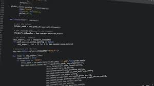

# Usman Ali Khan — Portfolio

Personal portfolio built with Next.js 13, Tailwind CSS, and Framer Motion, featuring smooth section transitions, custom cursor, and a light/dark theme toggle.



## Highlights

- Scroll-snap single-page layout with section anchors (Home, About, Experience, Projects, Tech, Contact)
- Framer Motion animations and modal project details
- Custom cursor interactions and floating/particle background effects
- Theme toggle with system preference support

## Tech Stack

- Next.js 13 (pages router)
- React 18
- Tailwind CSS
- Framer Motion
- tsParticles (slim)
- next-themes + lucide-react

## Getting Started

```bash
npm install
npm run dev
```

Open [http://localhost:3000](http://localhost:3000).

## Build & Export

```bash
npm run build
```

This runs `next build` and `next export`, producing a static site in the `out/` directory.

## Deploy (GitHub Pages)

```bash
npm run deploy
```

This publishes the `out/` directory via `gh-pages`.
